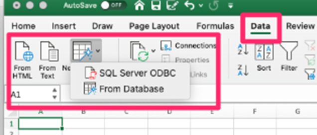
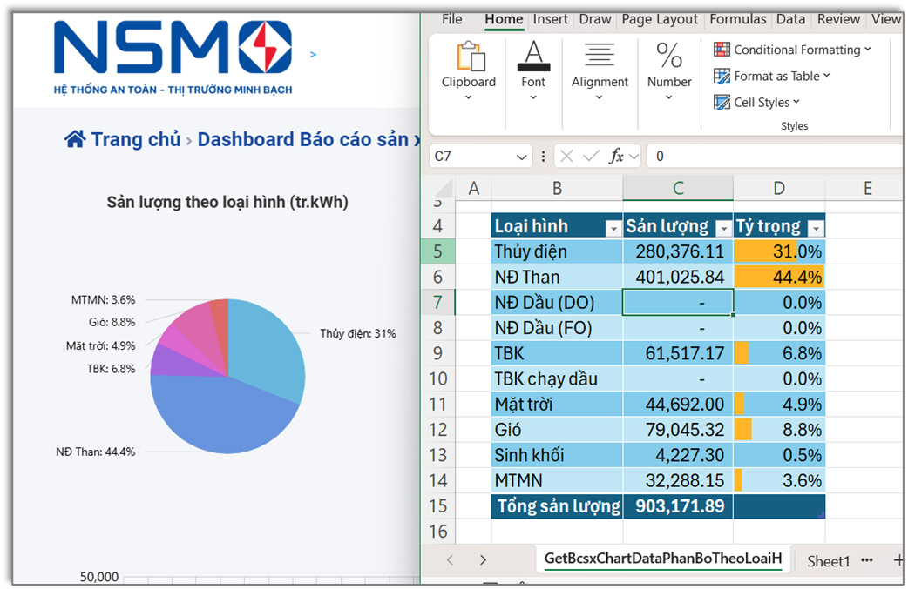

# THU THẬP DỮ LIỆU TỪ WEB

## Thu thập từ trang web tĩnh

Toàn bộ nội dung cần thu thập đã nằm sẵn trong 1 trang web với 1 URL duy nhất.\
Dấu hiệu đặc trưng là khi __View Source__ trang web thì có thể nhìn thấy nội dung cần tìm

Vậy để thu thập, chỉ cần 3 thao tác chính:

1. Tải về trang theo theo URL chỉ định
2. Xác định vị trí của nội dung cần tìm theo __XPath__, __JS Path__
3. Chỉ định bộ HTML Parser lấy chính xác nội dung theo vị trí đã tìm.

Ví dụ, chương trình sau sẽ lấy thông tin địa chỉ liên hệ, số điện thoai của công ty NSMO.

```shell
    python ./nsmo_contact_extractor.py
```

Kết quả

```shell
=======================================================
KẾT QUẢ TRÍCH XUẤT ĐỊA CHỈ LIÊN HỆ
=======================================================
Liên hệ
A. Tầng 8-12, số 11 phố Cửa Bắc, phường Ba Đình, thành phố Hà Nội
P. +84-24-3927 6178
F. +84-24-3927 6180
E.
=======================================================
```

Chương trình được sinh từ lời Prompt:

- Promt Gemini lần 1:
    > Hãy viết một chương trình python để đọc phần footer của trang web https://www.nsmo.vn/ và tìm ra địa chỉ liên hệ ở footer.

- Promt Gemini lần 2:
    > Hãy viết một chương trình python để đọc phần footer của trang web https://www.nsmo.vn/ và tìm ra địa chỉ liên hệ ở vùng //*[@id="Footer"]/div[1]/div[2]/div[4]

## Thu thập từ trang WebAPI qua HTTP Get

Đọc bảng tỷ giá ngoại tệ và tỷ giá vàng từ Web API <https://techcombank.com/content/techcombank/web/vn/vi/cong-cu-tien-ich/ty-gia/_jcr_content.exchange-rates.integration.json>

Chạy chương trình

```shell
    python ./techcombank_rate_extractor.py
```

Kết quả

```text
=======================================================
KẾT QUẢ TRÍCH XUẤT TỪ 'exchangeRate.data'
=======================================================
Đã tìm thấy 15 bản ghi. 5 bản ghi đầu tiên:
itemId label askRate bidRateCK bidRateTM sourceCurrency targetCurrency askRateTM                inputDate
 10381   AUD 17809.0   17233.0   16963.0            AUD            VND   17829.0 2025-12-13T08:32:01.377Z
 11839   CAD 19459.0   18833.0   18556.0            CAD            VND   19468.0 2025-12-13T08:32:01.377Z
 11202   CHF 33413.0   32771.0   32388.0            CHF            VND   33445.0 2025-12-13T08:32:01.377Z
 11576   CNY  3830.0    3470.0       NaN            CNY            VND       NaN 2025-12-13T08:32:01.377Z
 10590   EUR 31543.0   30512.0   30238.0            EUR            VND   31621.0 2025-12-13T08:32:01.377Z
...
=======================================================
```

__Hỗ trợ__: công cụ phân tích cấu trúc json và tạo đường dẫn JS Path tới nội dung mong muốn <https://jsonpathfinder.com>

Chương trình được sinh từ lời Prompt cho Google Gemini:
> Hãy viết một chương trình python để đọc tỷ giá hối đoái từ URL https://techcombank.com/content/techcombank/web/vn/vi/cong-cu-tien-ich/ty-gia/_jcr_content.exchange-rates.integration.json.
Lưu phần phần key $.exchangeRate.data vào một mảng có cấu trúc

## Thu thập từ trang WebAPI qua HTTP Get

Đọc dữ liệu điện mặt trời mái nhà từ URL <https://www.nsmo.vn/Dashboard/GetSoLieuCongSuatMtmn>

Chạy chương trình

```shell
    python ./nsmo_rooftopsolar_extractor.py
```

Kết quả

```text
=======================================================
KẾT QUẢ TÁI CẤU TRÚC DỮ LIỆU CÔNG SUẤT ĐIỆN MẶT TRỜI
=======================================================
Đã trích xuất 5 series dữ liệu.

--- Series đầu tiên: 'EVNNPC' ---
Tổng số điểm dữ liệu: 240
20 điểm dữ liệu đầu tiên:
  1: {'value': 0.0, 'time': '2025-12-08T00:30:00'}
  2: {'value': 0.0, 'time': '2025-12-08T01:00:00'}
  3: {'value': 0.0, 'time': '2025-12-08T01:30:00'}
  4: {'value': 0.0, 'time': '2025-12-08T02:00:00'}
  5: {'value': 0.0, 'time': '2025-12-08T02:30:00'}
...
=======================================================
```

Chương trình được sinh từ lời Prompt cho Google Gemini:
> Hãy viết một chương trình python để công suất điện mặt trời mái nhà https://www.nsmo.vn/Dashboard/GetSoLieuCongSuatMtmn
Lưu phần phần key x.result.data vào một mảng có cấu trúc dạng {name, data}.  Sau đó bóc tách sâu hơn với các key $.result.data[i].data thì lưu vào mảng con bên trong với cấu trúc {value, time}.

## ĐỒng bộ dữ liệu từ Web vào bảng tính trong Excel

- Excel cho phép phân tích nội dung từ các trang web, đặc biệt là payload từ các WebAPI và chuyển đổi thành một bảng số liệu trong Excel
- Bảng dữ liệu đó được tự động cập nhật khi
  - File Excel mới được mở
  - Bấm nút Refresh trên giao diện
  - Tự động sau mỗi xx phút.



Chức năng"Get Data" trong Excel (còn gọi là Lấy Dữ liệu hoặc Get & Transform Data) là công cụ mạnh mẽ giúp nhập dữ liệu từ nhiều nguồn khác nhau (Web, file, database,...)

File kết quả [ở đây](./nsmo_webdata.xlsx)



## Phụ lục

==> [Kết nối với CSDL SQL Server](./README.DB.md)